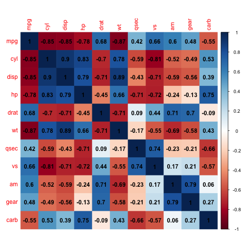
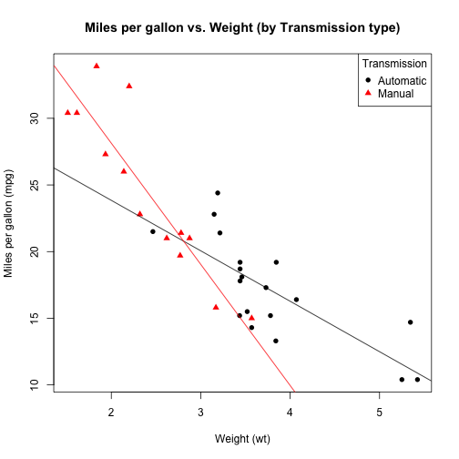

Data Products Week 3
========================================================
author: Jeff Grady 
date: 2017-11-03
autosize: true

Regression Models Course Project
========================================================

- Correlation matrix heatmap for `data("mtcars")`

Regression Models Course Project (cont'd)
========================================================

- Weight changes which type of transmission yields the best miles-per-gallon

Thanks!
========================================================

